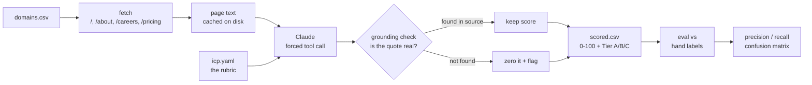

# icp-scorer

Score B2B accounts against a written ICP rubric using Claude — then **measure whether the scoring is any good** against a hand-labelled set.

Everybody builds a lead scorer. Almost nobody checks if it's right. This repo does both, and refuses to award points for evidence the model made up.


---

## The problem

An SDR working a 500-account list spends the first half of every week deciding which accounts are worth a touch. That decision is repetitive, it's inconsistent between reps, and it's the highest-leverage judgment in the whole outbound motion.

You can hand it to a model. The catch is that a model will happily tell you a company just raised a Series B when it did not, and a scoring system you can't audit is worse than no scoring system — it launders a guess into a number that a rep then trusts.

So this does three things:

1. **Puts the ICP in a file, not a prompt.** `icp.yaml` holds five weighted dimensions with explicit 0–3 guidance. A GTM person edits it; nobody touches Python.
2. **Forces every score to cite the page.** The model must return a verbatim quote from the company's own website for each dimension. Every quote is then checked against the text we actually fetched. **If the quote isn't there, the score is zeroed and flagged.**
3. **Measures itself.** `evals/labels.csv` holds accounts labelled fit / not-fit by hand. `make eval` prints a confusion matrix, precision, recall, and the list of accounts it got wrong.

---

## How it works



**Structured output via tool use.** The scorer doesn't ask for JSON and hope. It defines a tool whose input schema constrains scores to integers 0–3 over exactly the rubric's dimension keys, then forces the model to call it with `tool_choice`. The API guarantees the shape, so there is no parsing of prose and no "sometimes it wraps the JSON in a code fence" class of bug.

**The grounding check** (`src/icp_scorer/grounding.py`) normalises both the quote and the page text, tries a substring match, and falls back to a sliding-window fuzzy match at 0.85 similarity — because models fix typos and drop punctuation when they quote. Below that threshold, the quote is treated as invented.

**Caching is keyed by a fingerprint of `icp.yaml`.** Change the rubric and every score re-computes automatically. Don't change it and re-runs are free. This is what makes iterating on the rubric cheap enough to actually do.

---

## Run it in three commands

No API key and no internet required — the demo runs against fictional company fixtures in `data/fixtures/`.

```bash
pip install -r requirements.txt
make test          # 20 tests, no network
make demo          # full pipeline, offline, no API key
```

Then the real thing:

```bash
cp .env.example .env      # add your ANTHROPIC_API_KEY
make score                # scores data/domains_sample.csv against real websites
make eval                 # measures the scorer against evals/labels.csv
```

Inspect a single account and see every quote the score was built on:

```bash
python -m icp_scorer explain gong.io
```

```
gong.io   82.2/100   Tier A

OK segment          3/3   (grounding 1.0)
      "Revenue intelligence for B2B sales teams"
!! buying_trigger   0/3   (grounding 0.41)
      "Gong raised a $250M Series E in 2026"
      REJECTED - quote not found in source. Model wanted 3/3.
```

That second block is the whole point of the repo.

---

## Results

Run `make eval` and paste your own numbers here. **Do not fill this in with numbers you didn't produce** — a fabricated metric is the one unrecoverable mistake in a portfolio project.

| Rubric version | Companies | Accuracy | Best cut-off | Notes |
|---|---|---|---|---|
| v1 — mid-market (50–500) | 34 | not run | — | rubric and labels disagreed with each other; scrapped |
| v2 — enterprise (1000+) | 35 | **68.6%** | 55 | first measured run. `buying_centre` weighted 2.0, `enterprise_scale` 1.5 |

Run with Gemini (`gemini-3.6-flash`), fit threshold 55. The threshold sweep showed
accuracy flat at 57.1% for every cut-off below 55, then jumping to 68.6% at 55–65 and
falling away above 70 — so 55 is a genuine plateau, not a number tuned to flatter the
result.

68.6% is not good enough to put in front of a rep yet. The next move is to read the
misclassified accounts and fix the *rubric*, not the code — which is the point of
having the eval in the first place.

The eval also prints a **threshold sweep** — what accuracy would be at every fit cut-off from 20 to 90 — and the list of misses split into false positives (a rep's time wasted) and false negatives (a good account missed). Those two errors cost different amounts, which is a GTM decision, not a modelling one.

---

## The labels are opinions, and that's the point

`evals/labels.csv` is 34 companies labelled fit / not-fit against the rubric in `icp.yaml`. Those labels encode a specific commercial judgment: *B2B SaaS, 50–500 people, sells to revenue teams, runs a human outbound motion.* Under that ICP, Notion is a bad account despite being an excellent company.

**Disagree with any row and change it.** The scorer is being measured against your judgment — scaling that judgment is the entire job. Extend the set toward 60+ rows before you trust the numbers; below about 30 the confidence interval is wider than the differences you're chasing.

---

## Layout

```
icp.yaml                   the rubric — the only file most people should edit
src/icp_scorer/
  config.py                loads the rubric, weights, tiers, fingerprint
  fetch.py                 pulls and caches /, /about, /careers, /pricing
  scoring.py               tool schema, prompt, the Claude call, grounding, totals
  grounding.py             the hallucination guard
  pipeline.py              CSV in, CSV + JSON out
  cli.py                   score / explain
evals/
  labels.csv               hand-labelled ground truth
  run_eval.py              confusion matrix, precision/recall, threshold sweep
data/fixtures/             fictional companies so the demo runs offline
tests/                     20 tests, no network, no API key
```

---

## Notes and limits

- **Homepages are thin evidence.** Employee count especially. A real deployment would layer a firmographic provider on top and use the site only for motion and trigger signals.
- **Set `ANTHROPIC_MODEL`** in `.env` to whichever model id is current if the default 404s.
- **Rate limiting is naive** — it's a sequential loop. At ten thousand accounts you'd want concurrency with a bounded worker pool and proper 429 backoff.
- **The grounding threshold (0.85) is a dial.** Raise it and you reject honest paraphrase; lower it and invented quotes start slipping through. It was set by looking at the rejects, not by theory.
- **Fixtures are fictional.** `data/fixtures/` contains invented companies written for this repo so the demo is deterministic and offline. They are not real businesses.

## What I'd do differently at 10x

Move fetching to a worker pool with a shared rate limiter; batch the model calls; store results in Postgres rather than CSV so scores are queryable over time; and add a second eval that measures *stability* — scoring the same 50 accounts twice and checking how many change tier, because a scorer that disagrees with itself is worse than one that's consistently a bit wrong.

## Licence

MIT.
